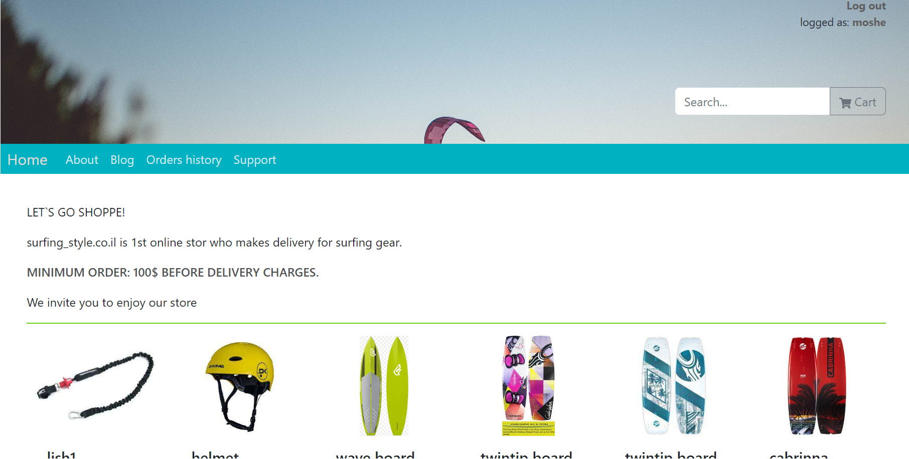

# My Project

Welcome to my project! This repository contains the code and documentation for my awesome project.

## Installation

To use this project, follow these steps:

1. Clone the repository: `git clone https://github.com/your-username/your-project.git`
2. Install the dependencies: `npm install`

## Usage

1. Run the project: `npm start`
2. Open your browser and visit `http://localhost:3000`

## Screenshots

Here are some screenshots of the project in action:

## Contributing

Contributions are welcome! If you find any issues or have suggestions for improvements, please open an issue or submit a pull request.

## License

This project is licensed under the [MIT License](LICENSE).
