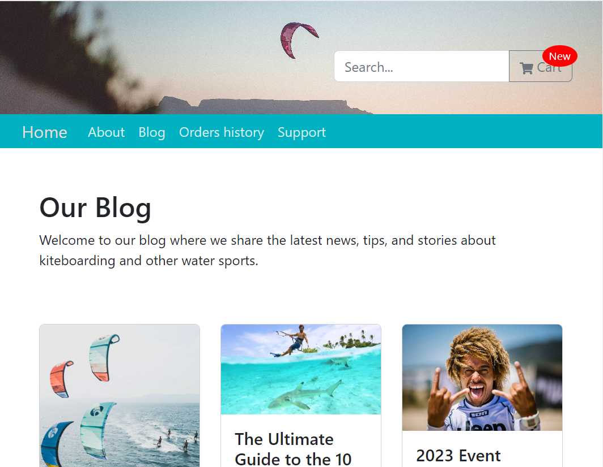

# My Project

# Project Live site: https://surfing-project.surge.sh/

Welcome to Surf Shop, your go-to online destination for all your surfing gear needs. This is a fake online shop created using React Vite, where you can explore and purchase a wide range of surfing gear and accessories.

  

## About the Application

Surf Shop is a web application that simulates an online shop experience for surfing enthusiasts. Built with React Vite, it provides a responsive and interactive user interface, making it easy to navigate through different products, add items to the cart, and complete the checkout process.

In addition to the regular user experience, Surf Shop also offers advanced functionality for authorized users:

- **Manager Account**: With a manager account, you have administrative privileges that allow you to control users, manage orders, and perform various administrative tasks. You can view and edit user profiles, delete users, update product inventory, and handle order management.
  
- *For an admin username and email, send me a private message*

- **Editor Account**: An editor account grants you access to specific pages where you can create and modify content. You can add new products, update product descriptions, and manage the overall content of the application.

To enhance the overall design and user interface, React Bootstrap was utilized in this project.

## Backend Integration

Surf Shop seamlessly integrates with a backend server to handle various functionalities. The application communicates with the server using requests to fetch product data, manage user authentication, and process orders. The backend server is responsible for handling these requests and interacting with the MongoDB database to store and retrieve relevant information.

## Installation

To use this project, follow these steps:

1. Clone the repository: `git clone https://github.com/lior92/surf-shop.git`
2. Navigate to the project directory: `cd surf-shop`
3. Install dependencies: `npm install`
4. In the `.env` file, fill up all the relevant configuration variables with the necessary values.
5. Start the development server: `npm run dev`

## Screenshots

Here are some screenshots of the project in action:

### User

#### Cart

  

#### Blog

  

#### User Detail

  

#### User Orders

  

##### Support

  

### Manager

  

